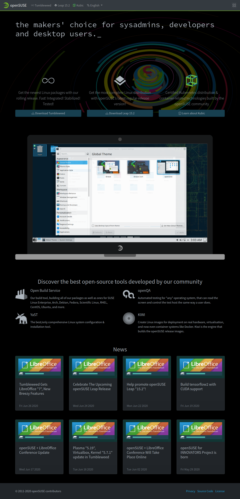

# www.opensuse.org

2020 new design



## Development

### How to set up environment?

```bash
sudo zypper in ruby ruby-devel
bundle install
```

### How to build?

```bash
bundle exec jekyll build
```

Resulting site will be in `_site` directory.

### How to serve locally?

```bash
bundle exec jekyll serve
```

Visit <http://localhost:4000/> in your browser.
